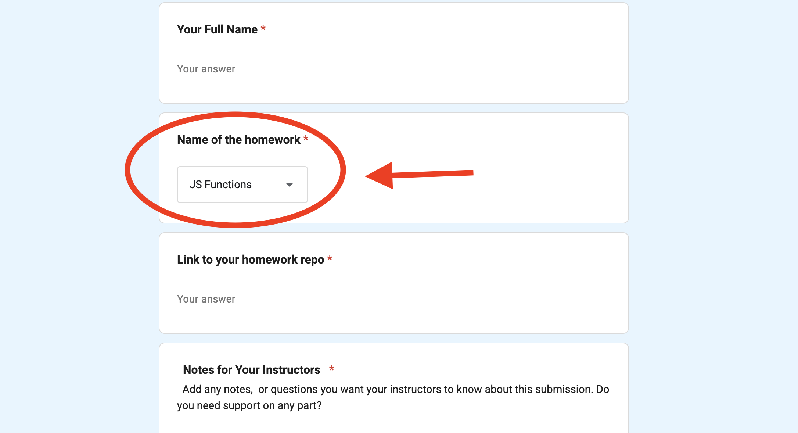
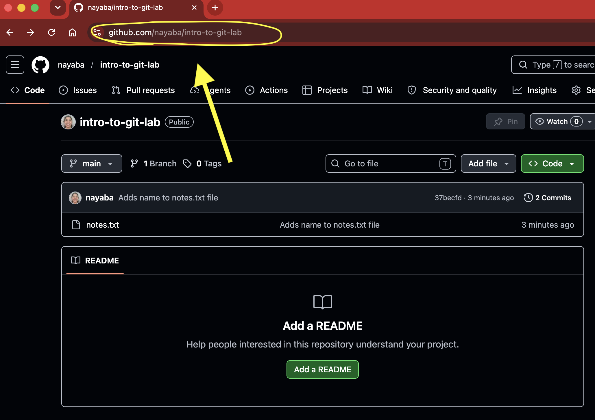
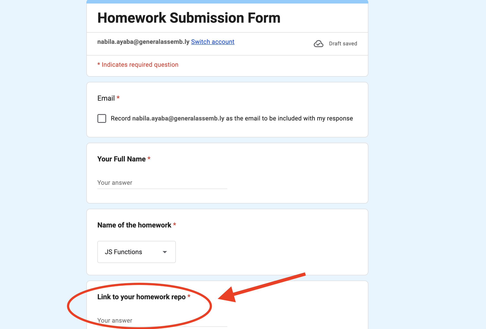

<h1>
  <span class="headline">How to Submit Homework</span>
  <span class="subhead">SEB 14</span>
</h1>

# Quick Reminder

**[Homework Submission Form](https://forms.gle/swnyWuaSsCex4c1F8)**.

Use these commands when you are ready to submit:

```bash
git status
git add .
git status
git commit -m "Completes homework assignment"
git push origin main
```

# Full Guide Below

Use this guide if you need help remembering how to submit a homework assignment or lab.

## Step 1: Save your work

Save all files before using Git.

* Windows: `Ctrl` + `S`
* macOS: `Command` + `S`

> ⚠️ Git only tracks changes that have been saved.

## Step 2: Check your Git status

```bash
git status
```

## Step 3: Stage your changes

```bash
git add .
```

Then check your status again:

```bash
git status
```

## Step 4: Commit your work

```bash
git commit -m "Complete homework assignment"
```

Your commit message should briefly explain what you changed.

## Step 5: Push to GitHub

```bash
git push origin main
```

This sends your latest work from your computer to GitHub.

## Step 6: Check GitHub

Go to your GitHub repository in the browser.

Refresh the page and check that your latest files appear.

> 💡 If your work is not on GitHub, your instructors cannot grade it.

## Step 7: Open the homework submission form

Go to the **[Homework Submission Form](https://forms.gle/swnyWuaSsCex4c1F8)**.

Choose the correct assignment from the dropdown menu.



## Step 8: Copy your GitHub repository link



## Step 9: Paste your GitHub link into the form



Then click **Submit**.

Great work! This is the process you will use for homework and labs throughout the course.

